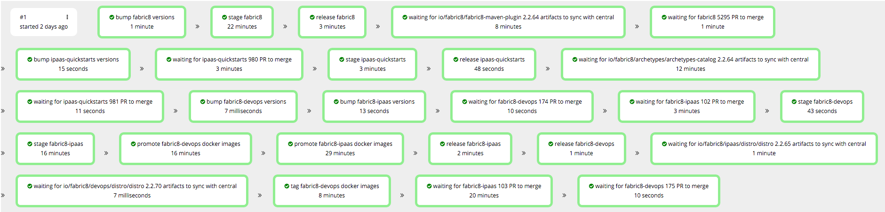

# Pipeline from fabric8

Runs a full end to end CD pipeline starting with [fabric8](https://github.com/fabric8io/fabric8)

The workflow will first check to see if there's a newer version of any fabric8 dependencies from a previous stage available, if there are then the workflow will update the dependency and submit a pull request so that the CI tests run.  Upon success of the CI job the dependency update pull request will be merged.

Artifacts released in this order:

1. [fabric8](https://github.com/fabric8io/fabric8)
2. [ipaas-quickstarts](https://github.com/fabric8io/ipaas-quickstarts)
3. In parallel: [fabric8-devops](https://github.com/fabric8io/fabric8-devops) & [fabric8-ipaas](https://github.com/fabric8io/fabric8-ipaas)

##Example pipeline view

