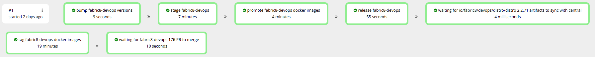

# Single release of fabric8-devops

Triggers a single release of [fabric8-devops](https://github.com/fabric8io/fabric8-devops)

The workflow will first check to see if there's a newer version of any fabric8 dependencies from a previous stage available, if there are then the workflow will update the dependency and submit a pull request so that the CI tests run.  Upon success of the CI job the dependency update pull request will be merged.

##Example pipeline view

